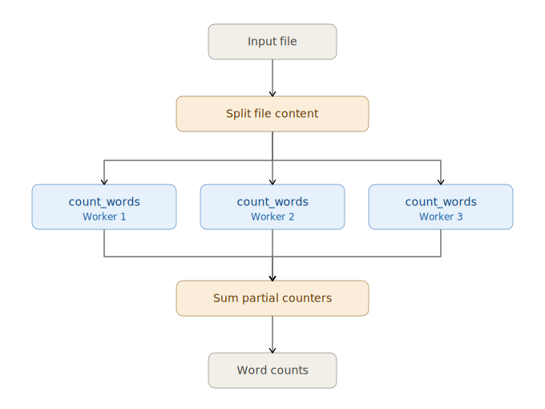

:orphan:

Basic parallel tasks using parfun
=================================

For more details about parfun features and APIs, see the
`parfun documentation <https://finos.github.io/opengris-parfun/>`_.

Count words with parfun
-----------------------

This simple example counts the number of words in a single large file.

Using parfun, the computation will be parallelized across multiple workers on a Scaler cluster using a map-reduce
strategy.

The ``@pf.parallel`` decorator is used to specify how input data should be split and how results should be combined.

.. literalinclude:: ../../../examples/libraries/count_words.py
   :language: python

To count the words in a file, you can run the following command, connecting to a
:doc:`running Scaler cluster <../tutorials/quickstart>`:

.. code-block:: bash

    python examples/libraries/count_words.py README.md --scaler-address tcp://127.0.0.1:8516
