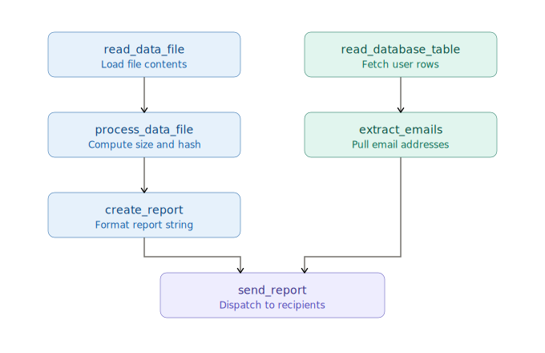

:orphan:

Basic graph tasks using pargraph
================================

For more details about pargraph features and APIs, see the
`pargraph documentation <https://github.com/finos/opengris-pargraph>`_.

Declarative workflow with pargraph
----------------------------------

Builds a small declarative graph where independent data-loading steps can run concurrently, then executes the resulting
graph through Scaler.

In this graph, two branches can run at the same time because they do not share dependencies:

- the file processing branch (``read_data_file`` -> ``process_data_file`` -> ``create_report``);
- the reporting branch (``read_database_table`` -> ``extract_emails``).

These branches join in ``send_report`` as both branch results are required to send the final report.

.. literalinclude:: ../../../examples/libraries/generate_report.py
   :language: python

To run the example with a remote scheduler, connecting to a
:doc:`running Scaler cluster <../tutorials/quickstart>`:

.. code-block:: bash

    python examples/libraries/generate_report.py --scaler-address tcp://127.0.0.1:8516
