.. Scaler documentation master file, created by
   sphinx-quickstart on Wed Feb 15 16:00:47 2023.
   You can adapt this file completely to your liking, but it should at least
   contain the root `toctree` directive.

.. title:: OpenGris Scaler

OpenGris Scaler
===============

Scaler is a lightweight distributed computing Python framework that lets you easily distribute tasks across single/multiple local machines, multiple different clouds.

.. image:: tutorials/images/client_usage_framework.svg
   :alt: Scaler architecture

Performances
------------

Scaler is efficient at scaling short tasks over a high number of CPUs with very low overhead and minimal latency.

The following benchmark shows the scaling performance of Scaler when running
`this parallel task <https://github.com/finos/opengris-parfun/blob/main/examples/count_bigrams/main.py>`_:

Content
-------

.. toctree::
   :maxdepth: 2

   tutorials/quickstart
   tutorials/installation
   tutorials/overview
   tutorials/commands
   tutorials/scaler_client
   tutorials/compatibility
   tutorials/scaling
   tutorials/worker_managers/index
   tutorials/additional_features
   tutorials/application_examples
   tutorials/development
