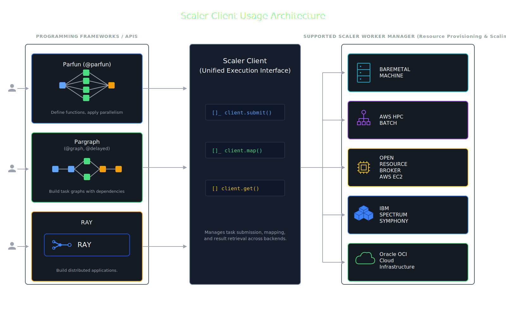

.. Scaler documentation master file, created by
   sphinx-quickstart on Wed Feb 15 16:00:47 2023.
   You can adapt this file completely to your liking, but it should at least
   contain the root `toctree` directive.

.. title:: OpenGris Scaler

.. raw:: html

   

     <h1 style="margin: 0;">OpenGris Scaler</h1>
   

Scaler is a lightweight distributed computing Python framework that lets you easily distribute tasks across single/multiple local machines, multiple different clouds.

Content
=======

.. toctree::
   :maxdepth: 2

   tutorials/quickstart
   tutorials/installation
   tutorials/overview
   tutorials/commands
   tutorials/scaler_client
   tutorials/compatibility
   tutorials/scaling
   tutorials/worker_managers/index
   tutorials/additional_features
   tutorials/application_examples
   tutorials/development
