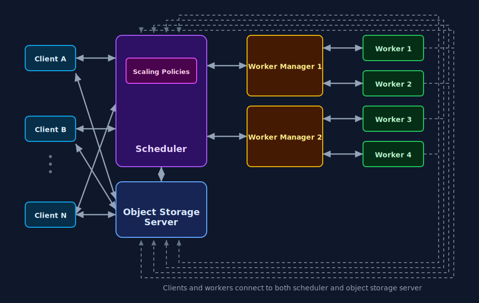

Introduction
============
Architecture
------------

Below is a diagram of the relationship between multiple Clients, the Scheduler,
Worker Managers, and Workers.

* Multiple clients can submit tasks to the same scheduler concurrently.
* The client is responsible for serializing tasks and arguments.
* Multiple worker managers can connect to the same scheduler and provision capacity in parallel.
* Worker managers spawn workers, and workers connect directly to the scheduler.
* The scheduler dispatches tasks to connected workers, and workers execute tasks and return results.

.. _introduction_installation:

Installation
------------

The ``opengris-scaler`` package is available on PyPI and can be installed using any compatible package manager.

Base installation:

.. code:: bash

    pip install opengris-scaler

If you need the web GUI:

.. code:: bash

    pip install opengris-scaler[gui]

If you use GraphBLAS to solve DAG graph tasks:

.. code:: bash

    pip install opengris-scaler[graphblas]

If you need all optional dependencies:

.. code:: bash

    pip install opengris-scaler[all]

Key Features
------------

* Cross cloud computing support with unified and single client api
* Easy spawn clusters on either local machine or clouds
* Python ``multiprocessing``-style client API, for example ``client.map()`` ``client.starmap()`` and ``client.submit()``.
* Graph tasks for DAG-based execution with explicit dependencies use ``client.get()``.
* Both CLI and WebUI Monitoring dashboard for real-time worker and task visibility.
* Task profiling for runtime and resource diagnostics.

For code API examples and client patterns, see :doc:`scaler_client`.

Spinning up Scheduler and Cluster Separately
--------------------------------------------

The object storage server, scheduler and workers can be spun up independently through the CLI.
Here we use localhost addresses for demonstration, however the scheduler and workers can be started on different machines.

.. code:: bash

    scaler_object_storage_server tcp://127.0.0.1:8517

.. code:: bash

    scaler_scheduler tcp://127.0.0.1:8516 -osa tcp://127.0.0.1:8517

.. code:: console

    [INFO]2025-06-06 13:30:05+0200: logging to ('/dev/stdout',)
    [INFO]2025-06-06 13:30:05+0200: use event loop: builtin
    [INFO]2025-06-06 13:30:05+0200: Scheduler: listen to scheduler address tcp://127.0.0.1:8516
    [INFO]2025-06-06 13:30:05+0200: Scheduler: connect to object storage server tcp://127.0.0.1:8517
    [INFO]2025-06-06 13:30:05+0200: Scheduler: listen to scheduler monitor address tcp://127.0.0.1:8518

.. code:: bash

    scaler_cluster -n 10 tcp://127.0.0.1:8516

From here, connect the Python Client and begin submitting tasks:

.. code:: python

    from scaler import Client

    def square(value):
        return value * value

    with Client(address="tcp://127.0.0.1:8516") as client:
        results = client.map(square, range(0, 100))

    print(results)
